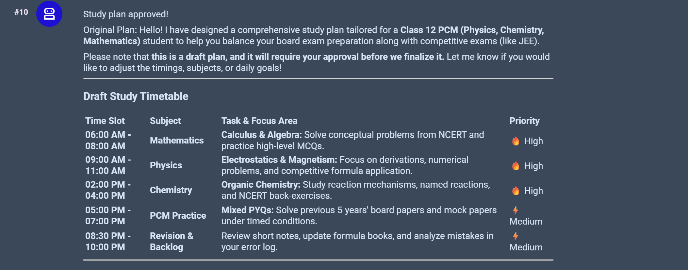
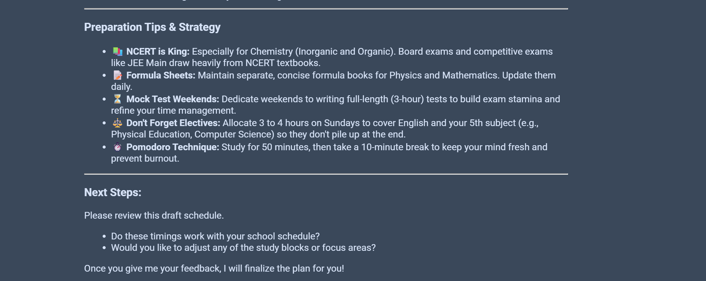
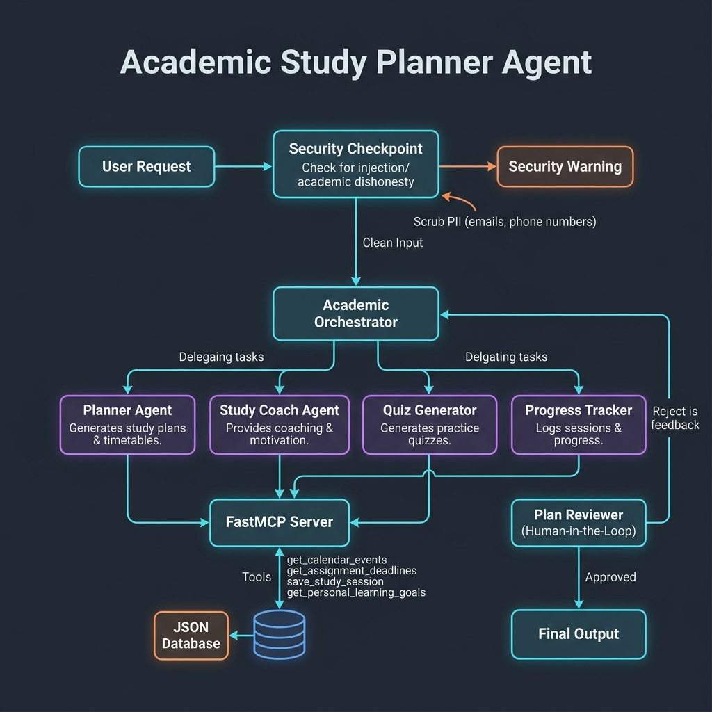

# 📚 Study Planner Agent


---

## 🚀 Features

- 🤖 AI-generated personalized study plans
- 📅 Daily study timetable generation
- 📖 Subject-wise task planning
- ⭐ Priority-based scheduling
- 📝 Revision and backlog planning
- 💬 Interactive chat interface

---

## 📸 Demo

### Study Plan






---

## 🛠 Tech Stack

- Python
- Google ADK
- FastAPI
- Agents CLI
- Git & GitHub

---

## 📐 Architecture



---

## 📂 Project Structure

```
study-planner/
│
├── app/
├── tests/
├── deployment/
├── images/
│   ├── demo1.png
│   └── demo2.png
│   └── banner.jpeg
│   └── workflow_architecture.png
├── README.md
└── pyproject.toml
```

---

## ⚙️ Installation

Clone the repository

```bash
git clone https://github.com/siddharth2019032/study-planner-agent.git
```

Move into the project

```bash
cd study-planner-agent
```

Install dependencies

```bash
agents-cli install
```

Run the project

```bash
agents-cli playground
```

---

## 🎯 Future Improvements

- Calendar Integration
- Reminder Notifications
- PDF Export
- Progress Tracking
- Mobile Friendly UI

---

## 👨‍💻 Author

**Siddharth Gautam**

B.Tech Electrical Engineering  
Delhi Technological University (DTU)

---

## ⭐ If you like this project

Please consider giving this repository a ⭐ on GitHub.
